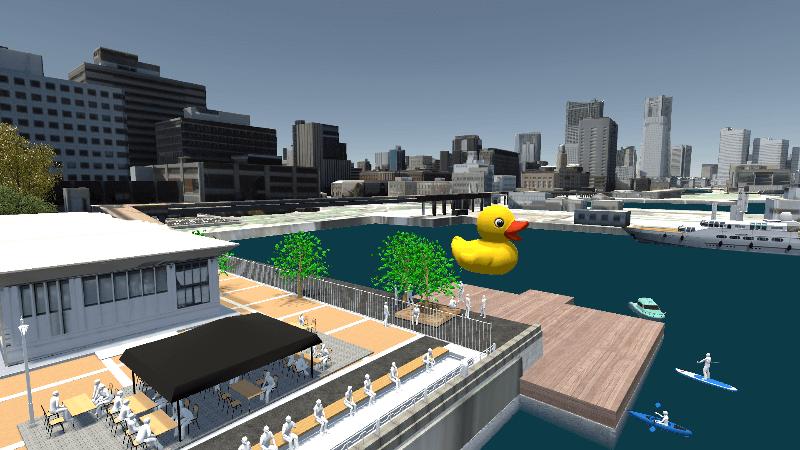

# PLATEAU TANGIBLE WEBアプリ

## 1. 概要
本リポジトリでは、2023年度のProject PLATEAUで開発した「PLATEAU TANGIBLE WEBアプリ」のソースコードを公開しています。  
「PLATEAU TANGIBLE WEBアプリ」は、「駒」を盤面に置くことで 3D 都市モデルや様々なオブジェクトを VR 都市空間へ反映するタンジブルインターフェース活用システムです。  
誰でも簡単に都市空間を編集できるようにすることで、市民参加型のまちづくりを支援します。  
本システムはタンジブルインターフェースとして機能する「駒」、「駒」を配置し、地図を表示する「盤面」、テーブル上の駒の座標をARマーカーにより読み取ってクラウドに送信するタンジブルユニットなどの筐体を前提としています。

## 2. 「PLATEAU TANGIBLE WEBアプリ」について
「PLATEAU TANGIBLE WEBアプリ」では、まちづくりや再開発などの都市計画の検討を支援します。タンジブルユニット上で実寸縮尺スケールの模型を動かし、WEBの3Dビューワーと動きをリンクさせることで直感的なまちづくりの検討を可能にしています。  
本システムの詳細については[技術検証レポート](https://www.mlit.go.jp/plateau/file/libraries/doc/plateau_tech_doc_0079_ver01.pdf)を参照してください。  

## 3. 利用手順
本システムの構築手順及び利用手順については[利用チュートリアル](./README_DEV.md)を参照してください。  

## 4. システム概要
### 【検討エリア設定】
#### ワークスペース、検討エリア設定
- 3Dモデルを配置し、検討したいエリアを地図上から設定します。
- タンジブルユニット側で扱う模型サイズに合わせた縮尺、範囲にエリアを設定します。

#### タンジブルユニット駒の設定
- タンジブルユニット側で扱う駒（模型）を選択します。
- 駒の3Dオブジェクトは予め作成し、本システムシステムに登録してある必要があります。
- 駒を選択すると二次元マーカーが割り振られるので、それをタンジブルユニット側の駒に貼り付けます。
- タンジブルユニット上の二次元マーカーの位置をシステムにリアルタイムで更新します。

### 【3Dビューワー】
- 設定したエリアを二次元の地図ではなく3D空間で確認できます。
- 3D空間上の基本建物はPLATEAUが提供しているLOD1データを利用してます。
- 地面に用いられる地図画像は国土地理院の画像を使用しています。

#### リアルタイム機能
- タンジブルユニット側でユーザーが駒を動かした場合、それを即時に3Dビューワーに反映します。

#### スナップショット機能
- その時点での駒配置、エリア情報を保存します。
- タンジブルユニットが動いていなくともかつての駒情報を再現し、ビューワーに表示します。

### 【連携用バックエンド】
#### API機能
- ワークスペース情報、エリア情報、タンジブルユニットのリアルタイム情報を外部から取得するためのAPIを提供しています。

## 5. 利用技術

| 種別 | 名称 | バージョン | 内容 |
| - | - | - | --|
| フレームワーク       | [React.js](https://ja.legacy.reactjs.org/) | 18.2.0 | WEBアプリ構築の基本フレームワークです |
| ライブラリ       | [Three.js](https://threejs.org/) | 0.158.0 | WEB上での3Dエンジンです。 |
| ライブラリ       | [react-google-maps-api](https://github.com/JustFly1984/react-google-maps-api/) | 2.18.1 | Google Mapエンジンです。WEBアプリ上での地図表示に利用します。 |
| API       | [国土地理院](https://cyberjapandata.gsi.go.jp/) | - | 国土地理院の地図画像を取得できるAPIです。 https://cyberjapandata.gsi.go.jp/xyz/std/{z}/{x}/{y}.png |
| フレームワーク      | [Firebase](https://firebase.google.com/?hl=ja) | 10.7.0 | Googleが運営する、サーバーサイドシステムにおける基幹フレームワークです。データベース管理、API管理、WEBアプリ本体の設置等、アプリ全体の管理を行います。 |

## 6. 動作環境 <!-- 動作環境についての仕様を記載ください。 -->
| 項目 | 最小動作環境 | 推奨動作環境 | 
| -- | -- | -- | 
| ブラウジング環境 | WEBブラウザが閲覧できる環境であれば構いません。 iPadなどのタブレット端末でも閲覧は可能です。 | Google Chrome 120 | 
| ネットワーク | 必須。 3Dビューモード（リアルタイム）では常に通信が発生するので、wi-fiなど通信制限の無い環境で閲覧してください。 | 同左 | 

## 7. 本リポジトリのフォルダ構成 <!-- 本GitHub上のソースファイルの構成を記載ください。 -->
| フォルダ名 | 詳細 |
|-|-|
| src | GUI |
| public/aruco | 二次元マーカーのsvg画像データ(0-120まで) |
| functions | API関連処理 |

## 8. ライセンス

- ソースコード及び関連ドキュメントの著作権は国土交通省に帰属します。
- 本ドキュメントは[Project PLATEAUのサイトポリシー](https://www.mlit.go.jp/plateau/site-policy/)（CCBY4.0及び政府標準利用規約2.0）に従い提供されています。

## 9. 注意事項

- 本リポジトリは参考資料として提供しているものです。動作保証は行っていません。
- 本リポジトリについては予告なく変更又は削除をする可能性があります。
- 本リポジトリの利用により生じた損失及び損害等について、国土交通省はいかなる責任も負わないものとします。

## 10. 参考資料
- 技術検証レポートv2: https://www.mlit.go.jp/plateau/file/libraries/doc/plateau_tech_doc_0079_ver01.pdf
- 技術検証レポートv1: https://www.mlit.go.jp/plateau/file/libraries/doc/plateau_tech_doc_0030_ver01.pdf
- PLATEAU WebサイトのUse caseページ「タンジブルインターフェースを活用した住民参加型まちづくり」: https://www.mlit.go.jp/plateau/use-case/uc23-009/
