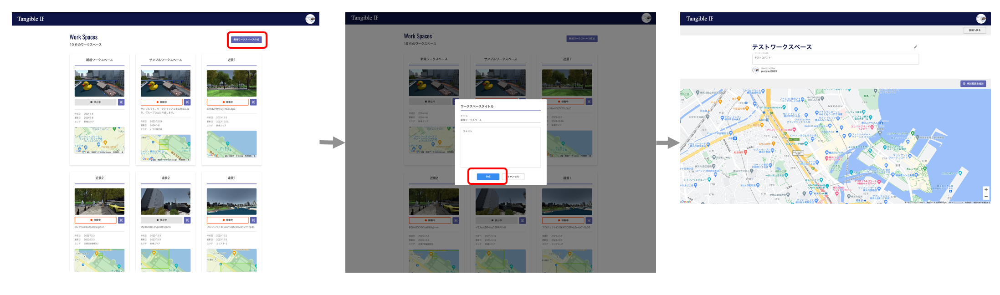
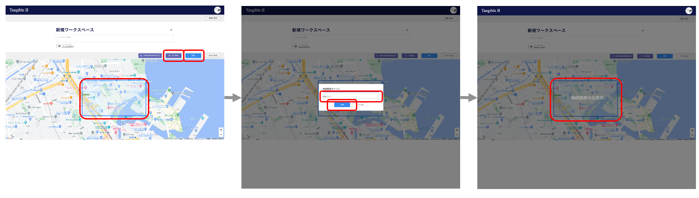
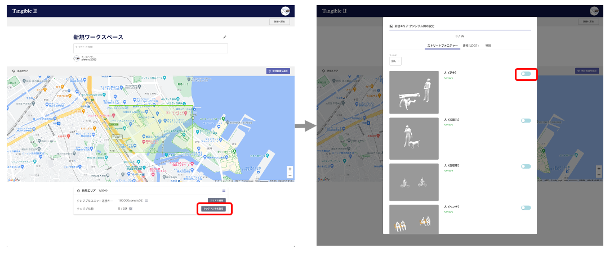

# PLATEAU TANGIBLE WEB アプリ

## 環境構築手順

### システム構成

#### フロントサイドアプリ

- Web フレームワーク：React.js (ver18.2.0)
- 3D 対応ライブラリ：Three.js (ver0.158.0)

#### バックエンドアプリ（SPA）

- Firebase Project
  - Authentication
  - Firestore Database
  - Cloud Storage
  - Cloud Function

### Firebase の設定

**※Firebase のプロジェクトの設定方法、ローカルでの環境構築方法、仕様方法については Firebase のドキュメントを[参照](https://firebase.google.com/docs?hl=ja)してください。**

#### タンジブル駒の登録

[データモデル](./DATAMODEL.md)を参考に、タンジブル駒（buildings、furnitures、specials）を登録しておきます。

#### Firebase Storage を localhost で使う際の注意点

- cors 設定で弾かれるため、cors.json を作成します

```
[
  {
    "origin": ["http://localhost:5173", "https://********.firebaseapp.com", "https://********.web.app"],
    "method": ["GET"],
    "maxAgeSeconds": 3600
  }
]
```

- cors.json を作成したフォルダ（基本はプロジェクトのルート）にて、gsutl コマンドを実行してください

```
gsutil cors set cors.json gs://********.appspot.com
```

#### Firebase Function の注意点

##### Puppeteer 設定

- 国土地理院の画像を生成するために Function 側で osm-static-maps というライブラリを利用していますが、このライブラリは puppeteer というライブラリを利用しています  
  この puppeteer は v19 以降でかなり破壊的な変更が加えられており、osm-static-maps の最新版では対応できていません  
  そのため、osm-static-maps の[github ページ](https://github.com/jperelli/osm-static-maps)からソースファイルを直接ダウンロードし、Function 内に直接追加しています(functions/third_party/osm/)
- Puppeteer を Cloud function にて使用する方法は[ここ](https://ths-net.co.jp/shopify_blog/puppeteer/)や[ここ](https://www.chikach.net/category/useful/puppeteer-v19-cloud-functions-workaround/)が参考になります

1. `.puppeteerrc.cjs`の追加

```
const {join} = require('path');
/**
 * @type {import("puppeteer").Configuration}
 */
module.exports = {
  // Changes the cache location for Puppeteer.
  cacheDirectory: join(__dirname, '.cache', 'puppeteer'),
};
```

<br/>

2. puppeteer をすでにインストールしていれば一度アンインストールし、再度インストール

<br/>

3. `firebase.json.`に追記

```
{
  "functions": [
    {
      "ignore": [
        ".cache", // これを追記
        ...
      ],
      ...
    }
  ],
  ...
}
```

- デプロイ時に Chromium 本体をアプロードしないため。そうしないと「パッケージが大きすぎるためデプロイできません」等のエラーがでます

<br/>

4. `package.json`(function 側)に追記

```
{
  "scripts": {
    "postinstall": "node node_modules/puppeteer/install.js", // これを追記
    ...
  },
  ...
}
```

- Cloud Functions ではデプロイ後の`npm install`時に Chromium が自動的にインストールされないので、postinstall でインストールスクリプトを実行してください。

### Aruco マーカー

- 予め 0 から 120 番までのマーカー画像を public/aruco に用意しています  
  Aruco マーカーについて、詳しくは、こちらの[サイト](https://github.com/okalachev/arucogen)を参照してください。

---

## 操作方法

本アプリでは、地図上の範囲、使用するタンジブルユニット、使用するタンジブル駒を関連付けたまとまりを「ワークスペース」と呼んでいます。

ログインユーザーはワークスペースを作成したり、スナップショットを登録したりすることができます。ここでは、本アプリの主な操作であるワークスペースの作成方法とスナップショットの作成方法を解説します。

### ワークスペースの作成

1. ログイン後、「新規ワークスペース作成」ボタンを押して、ワークスペースを作成します。



以降の操作は、検討範囲ごとに繰り返します。

2. 連携させるタンジブルユニットを指定します


3. 地図上を指定して検討範囲を設定します



4. 使用するタンジブル駒を指定します



### スナップショットの作成

1. ワークスペースの画面から「VR モード」ボタンを押して、VR モードを起動します
2. 「スナップショット作成」ボタンを押します
3. タイトルとコメントを入力して「保存」して完了です。


### API

アプリのデプロイに成功すると、API が使えるようになります。用意されている API の種類や仕様については[API ドキュメント](./API.md)を参照してください。
